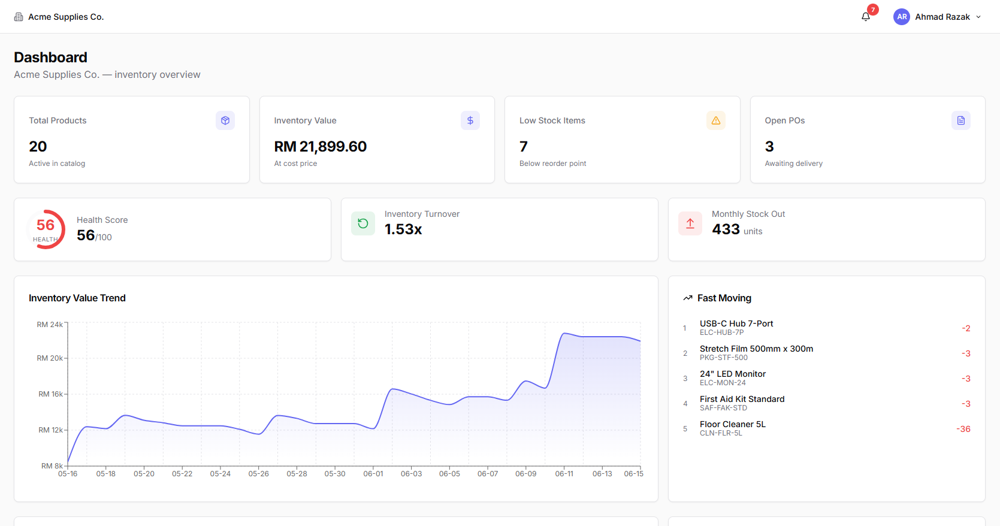
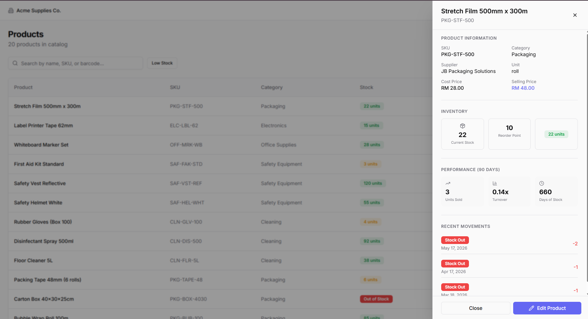
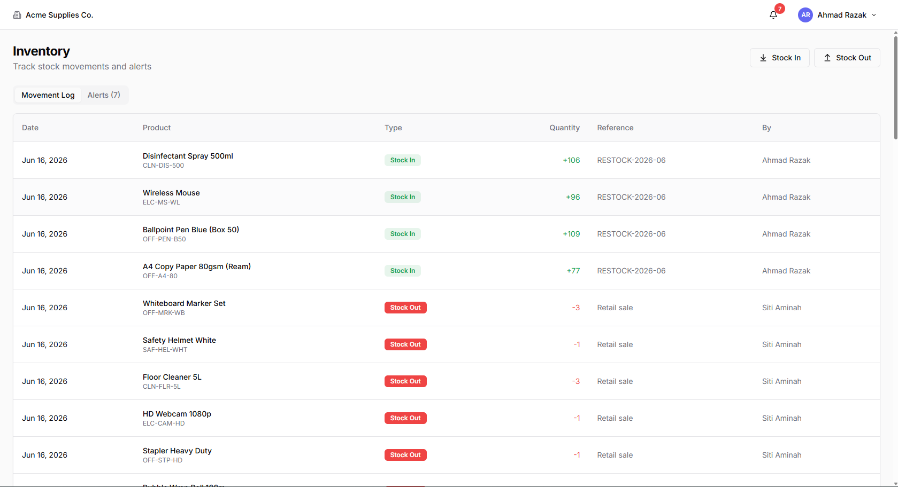
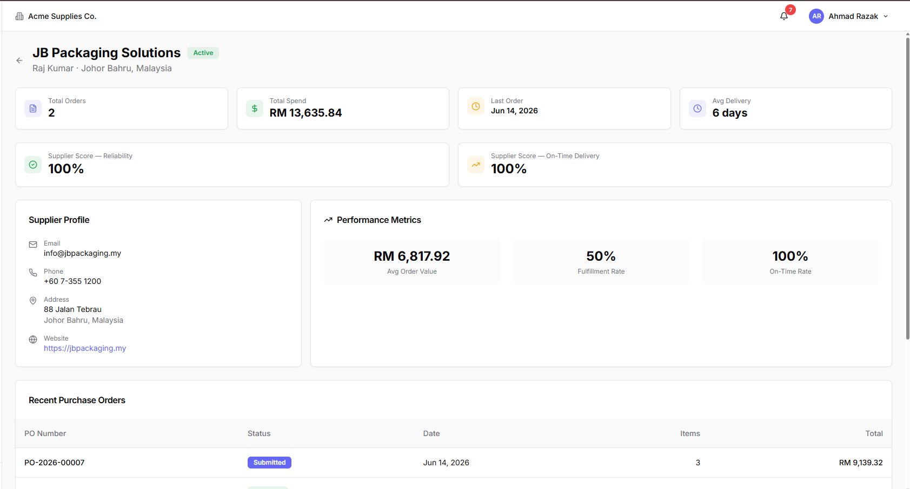
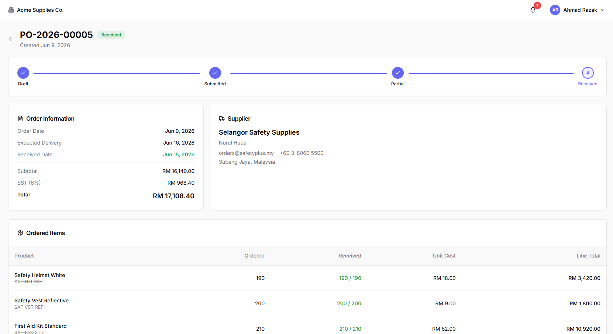
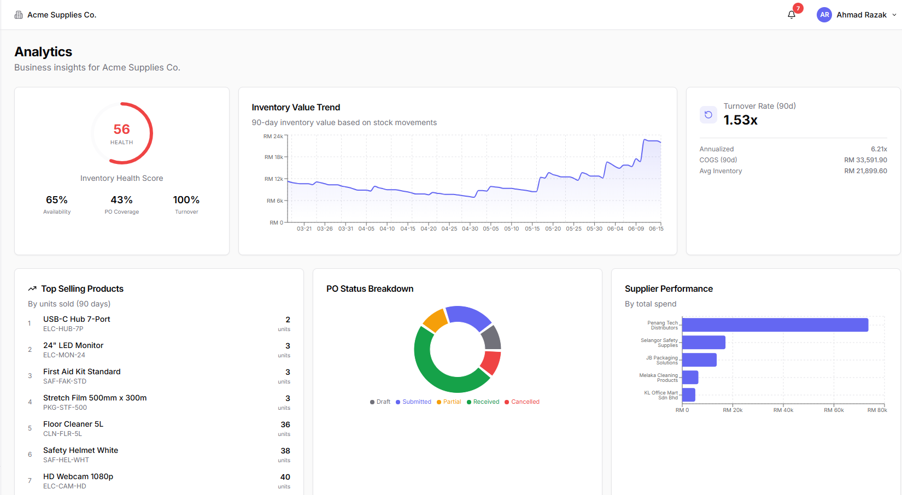

# StockFlow

Production-grade Inventory Management Platform — a full-stack SaaS application built for Malaysian SMEs.


## Demo

<p align="center">
  
  <br>
  <sub>Full 2-minute product walkthrough · <a href="https://github.com/Yokota110/stockflow-ai/blob/main/docs/demo.mp4">HD video (MP4)</a></sub>
</p>

### Screenshots

| Dashboard | Products | Inventory |
|:---:|:---:|:---:|
|  |  |  |

| Suppliers | Purchase Orders | Analytics |
|:---:|:---:|:---:|
|  |  |  |

## Features

- **Authentication** — JWT auth with refresh tokens, role-based access control (OWNER, ADMIN, MANAGER, STAFF, VIEWER)
- **Dashboard** — KPI cards, inventory value trend (MYR), health score, turnover metrics
- **Products** — Catalog with search, low-stock filter, and slide-out product detail drawer
- **Inventory** — Stock in/out workflows, movement ledger, real-time low-stock alerts with notification panel
- **Suppliers** — CRM-style supplier profiles with spend, delivery score, and products supplied
- **Purchase Orders** — Full PO lifecycle with status timeline, partial receive, and SST tax (6%)
- **Analytics** — Inventory aging, category performance, low-stock risk, top supplier rankings
- **Settings** — Organization config, team roles, notifications, light/dark mode
- **Malaysian SME context** — MYR currency, SST tax, realistic seed data (KL, Penang, JB suppliers)

## Tech Stack

| Layer | Technology |
|-------|-----------|
| Frontend | Next.js 15, React 19, TypeScript, Tailwind CSS, shadcn/ui, TanStack Query, Recharts |
| Backend | NestJS 11, Prisma, PostgreSQL |
| Auth | JWT + Refresh Tokens, RBAC |
| Infra | Docker Compose (PostgreSQL) |

## Quick Start

### Prerequisites

- Node.js 20+
- pnpm 9+
- Docker Desktop

### Setup

```bash
# Clone and install
pnpm install

# Start database
pnpm db:up

# Run migrations and seed demo data
cd apps/api
pnpm prisma:generate
pnpm prisma:migrate
pnpm prisma:seed

# Start development servers (from root)
cd ../..
pnpm dev
```

- **Frontend:** http://localhost:3000
- **API:** http://localhost:3001
- **Swagger Docs:** http://localhost:3001/docs

No extra environment variables are required for local development — the frontend defaults to `http://localhost:3001/v1`.

### Demo Credentials

```
Email:    demo@stockflow.app
Password: password123
```

## Project Structure

```
stockflow/
├── apps/
│   ├── api/          # NestJS backend
│   └── web/          # Next.js frontend
├── packages/
│   └── shared/       # Shared types and enums
├── docs/
│   ├── demo.mp4            # Demo walkthrough video (~2.4 MB)
│   ├── stockflow-demo.gif  # README full demo (2 min)
│   └── screenshots/        # README screenshots
├── docker-compose.yml
└── package.json
```

## API Endpoints

| Module | Endpoints |
|--------|-----------|
| Auth | `POST /v1/auth/register`, `login`, `refresh`, `logout`, `GET /me` |
| Products | `GET/POST/PATCH/DELETE /v1/products`, categories CRUD |
| Inventory | `POST /v1/inventory/stock-in`, `stock-out`, movements, alerts |
| Suppliers | Full CRUD + purchase history |
| Purchase Orders | Create, submit, receive, cancel |
| Analytics | Dashboard KPIs, health score, inventory aging, category performance, low-stock risk |

All endpoints (except auth) require:
- `Authorization: Bearer <token>`
- `X-Organization-Id: <orgId>`

## Architecture Highlights

- **Multi-tenant** — Row-level isolation via `organizationId`
- **Inventory ledger** — Immutable movement records, not mutable counters
- **PO lifecycle** — Draft → Submitted → Partial/Full Receive
- **Type-safe monorepo** — Shared types across frontend and backend
- **Production UI** — KPI dashboard, Recharts, command-ready layout

## Author

**横田 伊春 (Yokota Ishun)** — Full Stack Developer · Shiki, Saitama, Japan

Portfolio project showcasing end-to-end SaaS development — from multi-tenant API design to production UI.

| | |
|---|---|
| **GitHub** | [Yokota110/stockflow-ai](https://github.com/Yokota110/stockflow-ai) |
| **Email** | [richunyokota93@gmail.com](mailto:richunyokota93@gmail.com) |
| **Languages** | Chinese (native) · Japanese (JLPT N2) · English (business) |
| **Experience** | Neusoft → Neusoft Reach (2015–2022) · Freelance Full Stack Developer (2023–present) |
| **Stack** | TypeScript, React, Next.js, Node.js, NestJS, PostgreSQL, AWS, Docker |

## License

MIT
